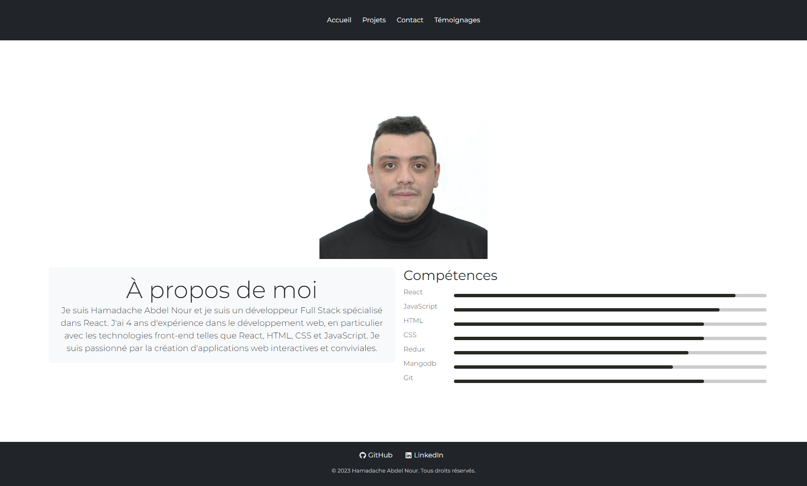
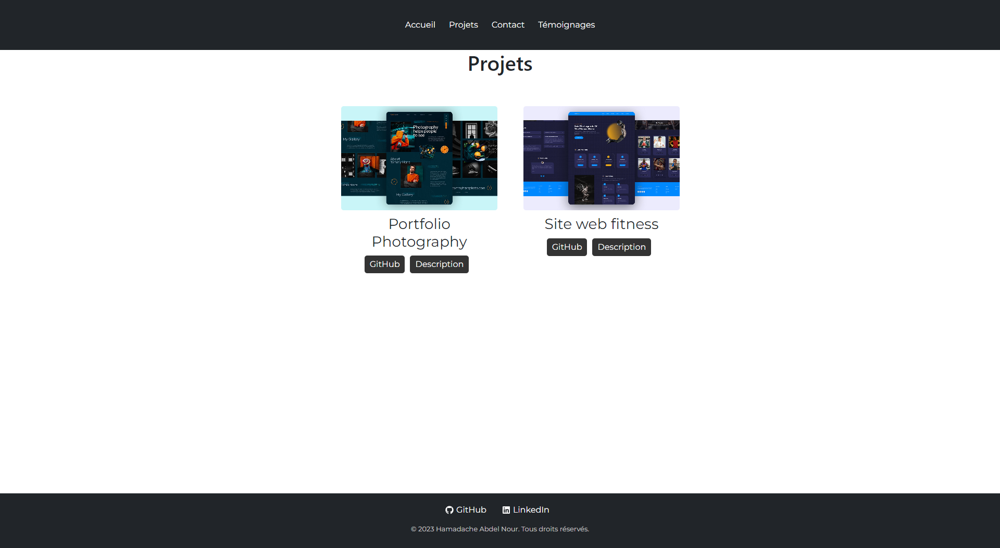
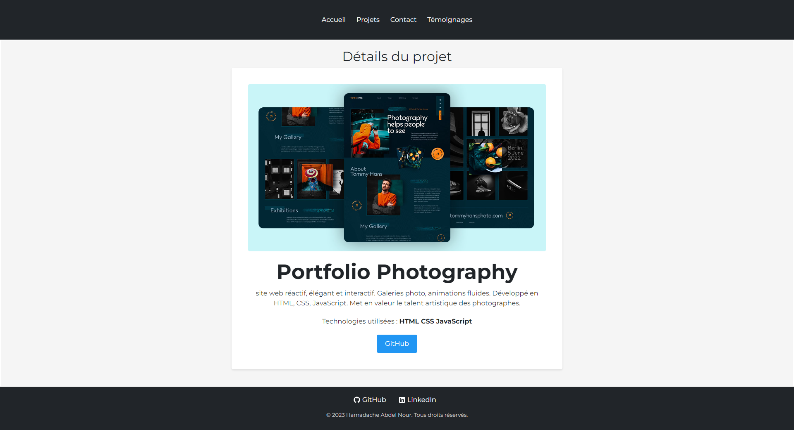
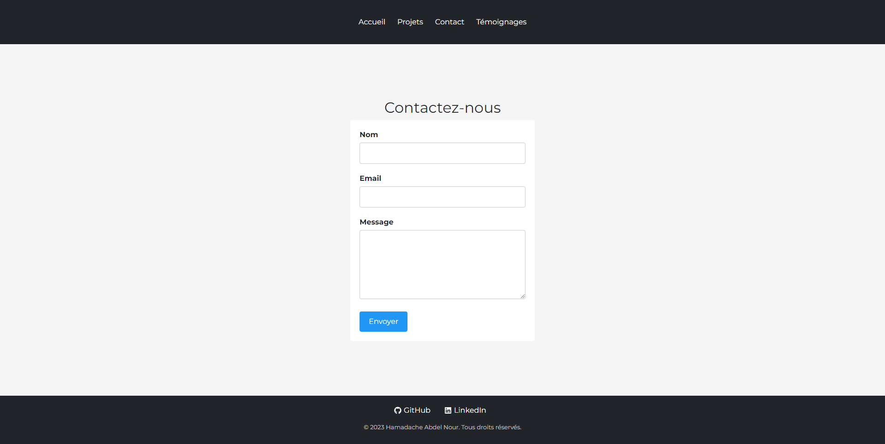
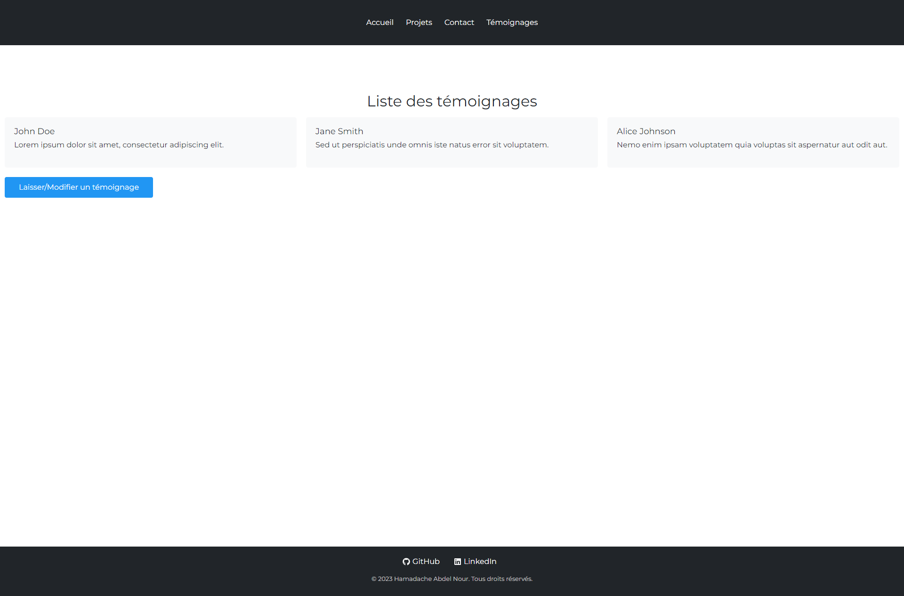
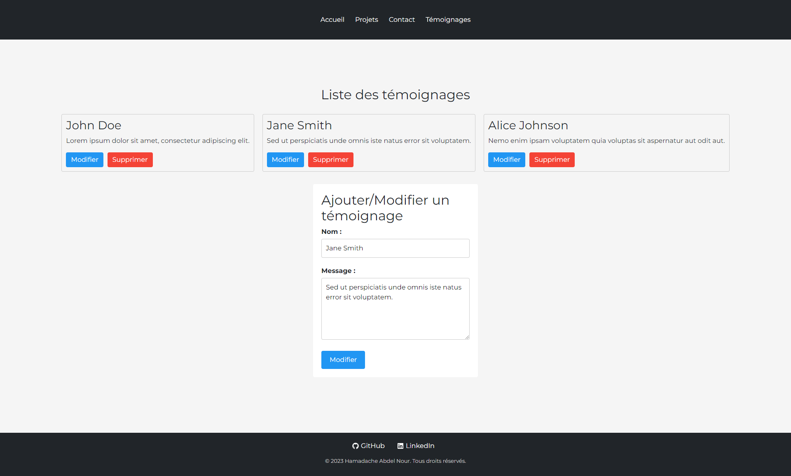

This is a [Next.js](https://nextjs.org/) project bootstrapped with [`create-next-app`](https://github.com/vercel/next.js/tree/canary/packages/create-next-app).

## Getting Started

First, run the development server:

```bash
npm run dev
# or
yarn dev
# or
pnpm dev
```

Open [http://localhost:3000](http://localhost:3000) with your browser to see the result.

You can start editing the page by modifying `app/page.js`. The page auto-updates as you edit the file.

This project uses [`next/font`](https://nextjs.org/docs/basic-features/font-optimization) to automatically optimize and load Inter, a custom Google Font.

## Description du Projet

Ce projet est une application web développée en utilisant Next.js, qui est un framework JavaScript basé sur React pour le rendu côté serveur. L'application est un site personnel pour Hamadache Abdel Nour, un développeur Full Stack spécialisé dans React et avec 4 ans d'expérience dans le développement web.

### Page d'Accueil

La page d'accueil (`Home`) présente ma présentation personnelle. Elle affiche une image de profil me représentant, ainsi qu'une section "À propos de moi" où je décris brièvement mes compétences en développement web, mettant en évidence mes 4 années d'expérience dans ce domaine et ma spécialisation en développement Full Stack avec une expertise particulière dans React, HTML, CSS et JavaScript.

La page d'accueil inclut également une section "Compétences" où je présente mes compétences techniques clés. Chaque compétence est accompagnée d'un niveau de maîtrise exprimé en pourcentage. Parmi mes compétences, je maîtrise React à 90%, JavaScript à 85%, HTML à 80%, CSS à 80%, Redux à 75%, MongoDB à 70%, et Git à 80%.

Cette page est conçue pour donner aux visiteurs une première impression de mes compétences en développement web et pour les inviter à en savoir plus sur mon profil et mes réalisations en explorant les autres sections du sit

### En-tête (Header)

L'en-tête (`Header`) est une barre de navigation située en haut de chaque page du site. Elle contient des liens pour accéder aux différentes sections du site, notamment l'accueil, les projets, le formulaire de contact et les témoignages.

### Pied de page (Footer)

Le pied de page (`Footer`) est situé en bas de chaque page du site. Il contient des liens vers le profil GitHub et le profil LinkedIn d'Hamadache Abdel Nour, ainsi que l'année de copyright.

Le projet utilise également des fichiers CSS pour la mise en page et la mise en forme. De plus, Bootstrap est utilisé pour le style CSS, et les icônes de GitHub et LinkedIn sont intégrées à l'aide de `react-icons`.



### Projets

La composante `Projects` représente la page "Projets" de mon site web. Cette page affiche une liste de projets que j'ai réalisés. Chaque projet est représenté par un élément de la liste, contenant une image illustrative, le titre du projet et des liens vers le référentiel GitHub du projet et une page de description dédiée.

Les projets affichés sur la page sont stockés dans un tableau `projects`, comprenant les détails de chaque projet, tels que le titre, l'image, le lien GitHub et le lien de description interne.

Pour rendre cette liste de projets, la composante `Projects` utilise une boucle `map` pour parcourir le tableau `projects`. Pour chaque projet, elle appelle le composant `Project`, qui reçoit les détails du projet en tant que propriété (`project`).

Chaque élément `Project` est stylisé avec une classe CSS pour créer un affichage attrayant des projets avec leurs images, titres et liens pertinents.

Cette page "Projets" a été conçue pour présenter mes réalisations aux visiteurs et leur permettre d'accéder rapidement aux détails des projets via les liens GitHub et les liens de description.



### Description du Projet

La composante `ProjectDetails` représente la page de détails d'un projet spécifique de mon site web. Cette page affiche des informations détaillées sur un projet en particulier, en fonction de l'ID du projet passé en paramètre.

La fonction `getProjectDetails` est utilisée pour récupérer les détails spécifiques du projet en fonction de son ID. Dans cet exemple, deux projets sont disponibles, identifiés par les IDs "1" et "2". Chaque projet possède un titre, une description, une image représentative, un lien vers le référentiel GitHub du projet et une liste de technologies utilisées.

Lorsque l'utilisateur accède à la page de détails d'un projet spécifique, la composante `ProjectDetails` appelle la fonction `getProjectDetails` pour récupérer les détails du projet correspondant à l'ID passé en paramètre. Les détails récupérés sont ensuite affichés sur la page avec le titre, la description, l'image, les technologies utilisées et un lien vers le référentiel GitHub du projet.

La page de détails du projet est conçue pour fournir aux visiteurs une vue approfondie d'un projet spécifique, y compris les technologies utilisées et les liens pertinents pour explorer le code source sur GitHub.



### Contact

La section "Contact" est un composant de formulaire qui permet aux utilisateurs de soumettre des messages. Ce formulaire contient des champs pour le nom, l'email et le message. Lorsque l'utilisateur soumet le formulaire, les données sont vérifiées pour s'assurer que tous les champs sont remplis. Si certains champs sont manquants, une erreur est affichée. Sinon, le message est envoyé, et une confirmation de soumission est affichée à l'utilisateur.



### Témoignages

La page des témoignages ("testimonials") affiche une liste de témoignages laissés par des utilisateurs satisfaits. Les témoignages sont récupérés depuis le store Redux de l'application en utilisant le hook `useSelector`.

Chaque témoignage est représenté par un élément dans la liste, contenant le nom de la personne qui a laissé le témoignage (`testimonial.name`) et son message de témoignage (`testimonial.message`).

La page des témoignages vise à montrer aux visiteurs les retours positifs des utilisateurs de mon site. Cela peut contribuer à renforcer la crédibilité du site et à encourager de nouveaux utilisateurs à partager leurs expériences.

De plus, la page inclut un bouton "Laisser/Modifier un témoignage" qui redirige l'utilisateur vers une autre page (`/testimonials/add`) où il peut ajouter ou modifier un témoignage.



### Ajouter/Modifier/Supprimer un Témoignage

La page "Ajouter/Modifier un témoignage" est une page permet aux utilisateurs d'ajouter de nouveaux témoignages ou de modifier/supprimer des témoignages existants

La page affiche une liste des témoignages existants sous la section "Liste des témoignages". Chaque témoignage est représenté par un élément dans la liste, affichant le nom de la personne qui a laissé le témoignage et son message. Pour chaque témoignage, il y a des boutons "Modifier" et "Supprimer" qui permettent à l'utilisateur de gérer les témoignages.

La section "Ajouter/Modifier un témoignage" présente un formulaire où les utilisateurs peuvent saisir leur nom et leur message pour soumettre un nouveau témoignage ou mettre à jour un témoignage existant. Avant la soumission, le formulaire effectue des validations pour s'assurer que les champs sont correctement remplis.

Les témoignages et leurs modifications sont gérés à l'aide de Redux. Les actions `addTestimonial`, `editTestimonial` et `deleteTestimonial` sont utilisées pour ajouter, modifier et supprimer les témoignages respectivement.

Lorsque l'utilisateur soumet un témoignage avec succès, un message de succès est affiché pour le notifier que le témoignage a été soumis avec succès.

La page "Ajouter/Modifier un témoignage" est conçue pour permettre aux utilisateurs de partager leurs retours et leurs expériences avec le site, et pour faciliter la gestion des témoignages de manière conviviale.


